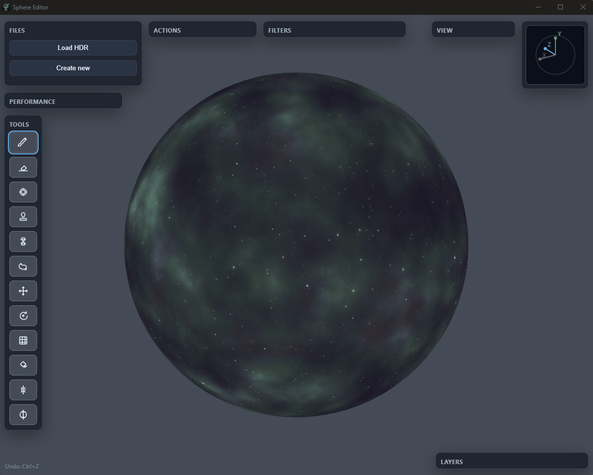
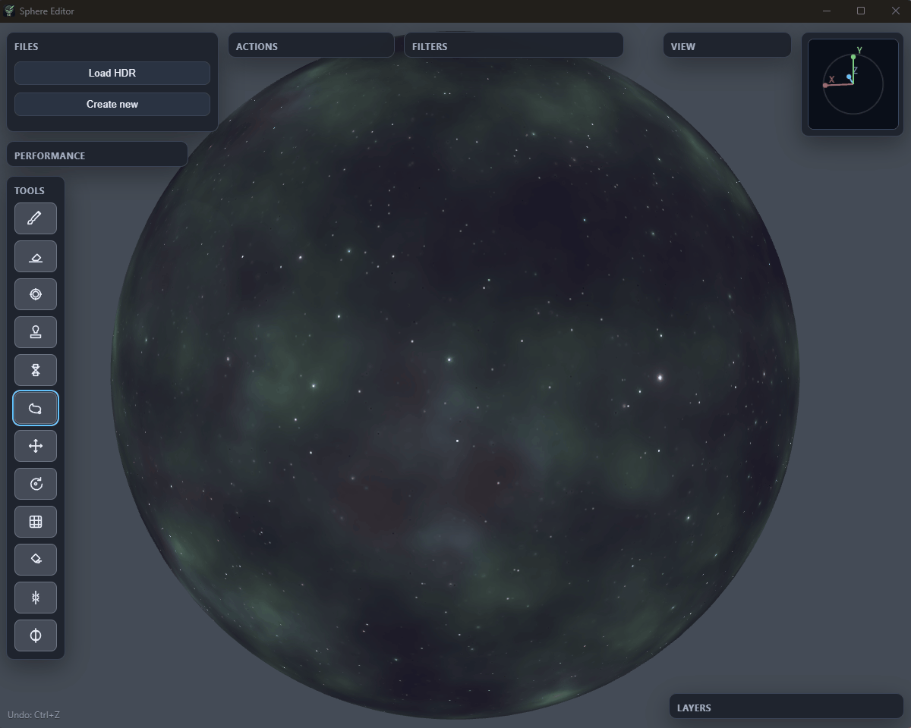
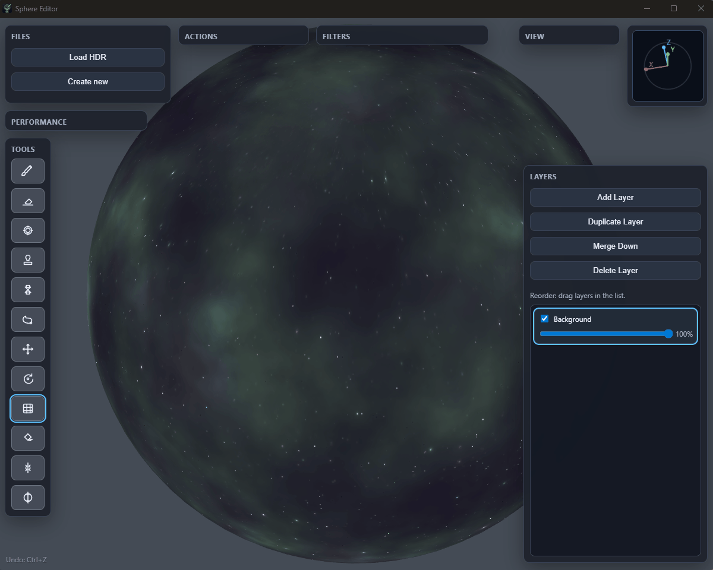
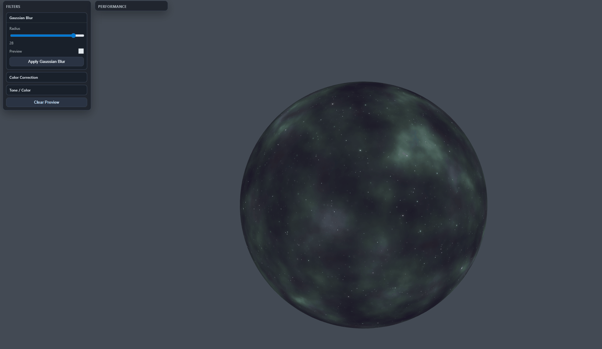

# Skybox Editor

**RU | [EN](README.en.md)**

Локальный редактор эквиректангуларных панорам и skybox-текстур с просмотром результата на 3D-сфере.

## Зачем создано приложение

### Проблематика
- В обычных 2D-редакторах сложно править skybox: линии и формы на полюсах и швах выглядят корректно в 2D, но искажаются на сфере.
- При ретуши панорам (удаление объектов, клонирование, блюр, маски) тяжело сразу видеть результат изнутри сцены.
- Нужен быстрый офлайн-инструмент без тяжелого пайплайна DCC/движка для итеративного рисования и проверки.

### Цель
- Дать художнику/тех-арту единый инструмент для правки и создания equirectangular-текстур с живым 3D-превью, слоями, выделениями и экспортом.

## Что умеет Skybox Editor

### Основное
- Загрузка существующей панорамы (`PNG/JPG/HDR`).
- Создание нового холста (2:1), выбор базового цвета и прозрачности.
- Редактирование на сфере с орбит-камерой и настройкой экспозиции.
- Экспорт в `PNG` и `HDR (original size)`.

### Важная настройка: Polar-safe mode
- Находится в окне `Performance`.
- Включает безопасную обработку на полюсах, чтобы уменьшить артефакты и искажения.
- Ключевой параметр: `Polar row samples` (`16..1024`, по умолчанию `64`).
- Влияет на качество инструментов возле полюсов: `Stamp`, `Healing`, `Brush texture`, `Texture Painting`.
- `16` (минимум): быстрее, но заметно более грубый/пиксельный результат.
- `1024` (максимум): лучшее качество и детализация, но выше нагрузка на CPU/GPU.

### Слои
- Список слоев с выбором активного.
- Добавление, дублирование, удаление.
- Drag-and-drop перестановка.
- Переименование слоя двойным кликом.
- Merge Down (верхний слой объединяется с нижним).
- Прозрачность слоя.

### Инструменты
- `Brush`
- `Eraser`
- `Blur`
- `Stamp (Clone)`
- `Healing`
- `Texture Painting`
- `Fill`
- `Lasso Select`
- `Move Layer`
- `Rotate Layer`
- Дополнительно: `Seam blend`, `Pole blend`

### Выделение (Lasso)
- Полигональное выделение, замыкание кликом по первой точке.
- Инверсия выделения.
- Копирование выделения и вставка в новый слой.
- Эффекты и фильтры применяются только в пределах активного выделения.

### Фильтры
- Gaussian Blur (с превью до применения).
- Color Correction (с превью).
- Tone/Color (тени, полутона, света; с превью).

### Производительность
- Окно `Performance` с адаптивным батчингом.
- Polar-safe режим и настройка `Polar row samples`.
- Параметры для снижения лагов на полюсах при сложных мазках.

## Управление
- Рисование: `LMB`
- Орбита камеры: `Alt + LMB`
- Zoom: `Mouse Wheel`
- Undo: `Ctrl + Z`
- Copy Selection (Lasso): `Ctrl + C`

## Технологии
- `Three.js` для рендера сферы и интерактивного preview.
- `Electron` для desktop-приложения.
- `electron-builder` для portable-сборки под Windows.

## Установка и запуск (step-by-step)

### 1. Требования
- Windows 10/11
- Node.js `20.x`
- npm `10+`

### 2. Установка зависимостей
```bash
npm install
```

### 3. Генерация иконок
Если меняли исходную иконку `build/Icon_1024x1024.png`:
```bash
npm run icons
```

### 4. Запуск desktop-версии (Electron)
```bash
npm run start
```

### 5. Запуск web-режима (опционально)
```bash
npm run start:web
```
После этого открыть:
`http://localhost:5173`

## Сборка билдов (step-by-step)

### Portable `.exe`
```bash
npm run dist
```
Результат:
- `dist/Sphere-Editor-Portable-<version>.exe`

### Распакованная папка приложения
```bash
npm run dist:dir
```
Результат:
- `dist/win-unpacked/`

## Демо функций

### 1. Загрузка и орбита камеры


### 2. Кисть и ластик


### 3. Штамп и healing


### 4. Texture Painting


### 5. Lasso и заливка


### 6. Слои: перемещение и вращение


### 7. Фильтры


## Структура проекта
- `sphere-editor/` - UI и логика редактора
- `electron/` - desktop-обвязка
- `scripts/` - утилиты
- `build/` - исходник иконки и `icon.ico` для сборки
- `dist/` - артефакты сборки

## Примечания
- Проект ориентирован на офлайн-работу.
- Для корректного имени и иконки в билде всегда используйте сборку через `npm run dist`.

